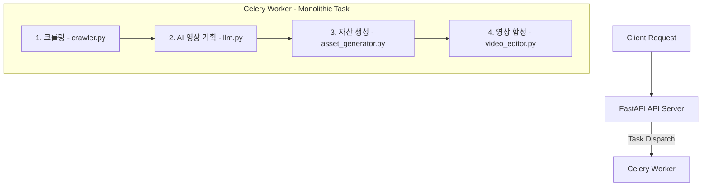
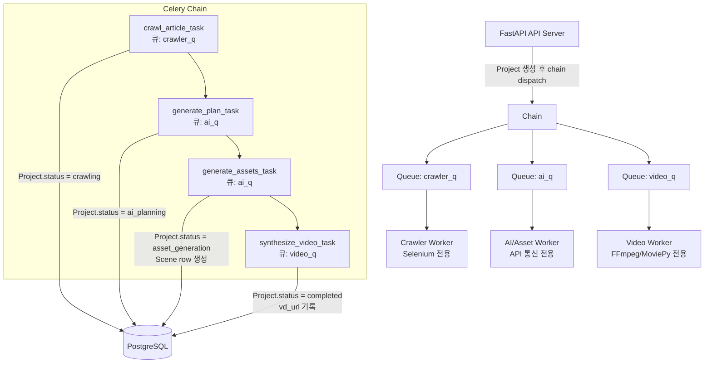
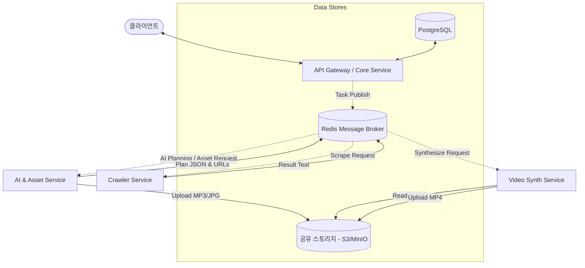
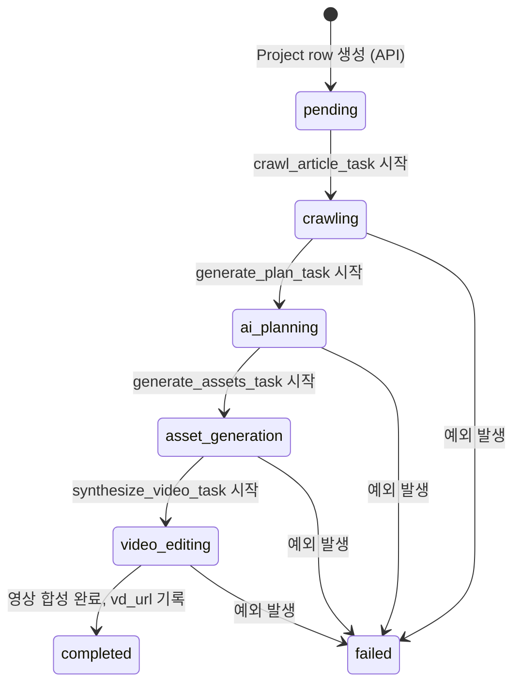

# AutoVd-BE 기능 분할 및 리팩토링 계획서

본 문서는 [ARCHITECTURE.md](file:///mnt/x/Dev/AutoVd-BE/ARCHITECTURE.md)를 기반으로, 기존의 단일 비동기 파이프라인으로 묶여 있던 **크롤링, AI/자산 생성, 비동기 영상 합성** 기능을 기능별로 분리하고 확장성 및 리소스 효율성을 극대화하기 위한 구조 개선 계획서입니다.

> **이 문서의 목표**: 각 기능(크롤링 / AI 기획 / 자산 생성 / 영상 합성)이 각각 독립적인 Celery Task를 갖도록 분리한다. MVP 단계인 만큼 **변경 용이성 · 모듈 단위 파악의 단순성 · 프로젝트 작업 상태 확인의 용이성**을 최우선 원칙으로 삼는다.

---

## 1. 현재 구조 및 문제점 분석

현재 [tasks.py](file:///mnt/x/Dev/AutoVd-BE/app/services/tasks.py)에서 실행되는 `generate_video_task`는 단일 Celery 태스크 내에서 아래 4가지 작업을 순차적으로 실행합니다.



### 실제 서비스 함수 시그니처 (모두 동기 함수)

| 단계 | 함수 | 위치 | 입력 | 출력 |
|------|------|------|------|------|
| 1. 크롤링 | `extract_article(url)` | `app/services/crawler.py:12` | `url: str` | `{"title": str, "content": str}` |
| 2. AI 기획 | `generate_video_plan(article_text)` | `app/services/llm.py:9` | `article_text: str` | `{"scenes": [{"scene_number": int, "narration": str, "image_prompt": str}]}` |
| 3. 자산 생성 | `generate_assets(project_id, video_plan)` | `app/services/asset_generator.py:13` | `project_id: str, video_plan: dict` | `[{"scene_number": int, "audio_path": str, "image_path": str, "narration": str}]` |
| 4. 영상 합성 | `merge_video(project_id, scene_assets)` | `app/services/video_editor.py:17` | `project_id: str, scene_assets: list` | `output_path: str` |

> **파일 경로 규약**: `temp_projects/<project_id>/scene_<n>.mp3|.jpg`, 최종 결과 `temp_projects/<project_id>/<project_id>_final.mp4`

### 🚨 주요 문제점

1. **리소스 성격의 불일치 및 병목**:
   - **크롤링 ([crawler.py](file:///mnt/x/Dev/AutoVd-BE/app/services/crawler.py))**: Selenium Chrome 브라우저 실행으로 인한 메모리 소비가 큼.
   - **AI/자산 생성 ([llm.py](file:///mnt/x/Dev/AutoVd-BE/app/services/llm.py), [asset_generator.py](file:///mnt/x/Dev/AutoVd-BE/app/services/asset_generator.py))**: Gemini, Edge TTS, Pollinations.AI 등 외부 API I/O 바운드 작업. API 속도 제한 및 네트워크 대기에 영향받음.
   - **영상 합성 ([video_editor.py](file:///mnt/x/Dev/AutoVd-BE/app/services/video_editor.py))**: MoviePy/FFmpeg 기반의 극심한 CPU 및 디스크 I/O 바운드 작업.
2. **단일 장애 지점 (SPOF)**:
   - 자산 생성이나 영상 합성 중 하나라도 실패하면 전체 파이프라인을 처음부터 다시 실행해야 함.
3. **상태 추적 불가**:
   - 현재 `generate_video_task`는 **DB I/O가 전혀 없다.** `Project.status`는 API에서 `processing`만 찍힐 뿐 `completed`로 전이되지 않으며, `vd_url`은 절대 채워지지 않는다. `Scene` 테이블은 완전히 미사용.
   - 상태는 Celery `AsyncResult`의 단일 task_id로만 조회되어, 태스크를 쪼개면 현재 폴링이 깨진다.
4. **독립적 스케일링 불가능**:
   - 영상 합성 작업이 몰릴 경우, 가벼운 크롤링 작업까지 함께 큐에 쌓여 지연 발생.
5. **Celery 설정 공백**:
   - `app/core/celery_app.py`에 큐/라우팅 설정이 없으며, broker/backend가 `redis://localhost:6379/0`로 **하드코딩**되어 docker-compose의 `CELERY_BROKER_URL` env를 무시한다.

---

## 2. 기능 분할 목표 (Target Architecture)

### ✅ [권장안] Celery Queue 분리 기반의 모듈러 모놀리스 (MVP 최적)

코드베이스는 하나로 유지하되, 태스크를 세부 단위로 쪼개고 **Celery Queue**를 다르게 지정하여 리소스 그룹별로 워커를 분리합니다.



- **장점**: 분할 복잡도가 낮고 단일 DB를 공유하여 빠르게 구현 가능. DB에 진행 상태가 기록되므로 어느 단계까지 진행됐는지 즉시 확인 가능.
- **데이터 전달**: Celery `chain`의 반환값(in-memory)으로 다음 task에 전달. 추가 메시지 브로커 불필요.

---

### 🔮 [미래 확장] 완전 분리형 마이크로서비스 아키텍처 (MSA)

각 기능별 독립 컨테이너·독립 requirements로 완전히 격리. 현재 MVP에서는 과설계에 해당하므로 권장하지 않음.



> requirements 분리(`requirements-crawler.txt` 등), 개별 Dockerfile, REST/메시지 브로커 격리는 MSA 전환 시 적용한다.

---

## 3. 각 Task의 독립성 정의 (MVP 핵심)

**"독립적인 task"** 란 아래 5가지 기준을 모두 충족하는 것을 의미한다.

### ✅ 독립성 체크리스트

| 기준 | 설명 | 적용 방법 |
|------|------|-----------|
| **단일 책임** | 1 task = 1 서비스 모듈. 해당 모듈 파일 하나만 읽으면 task를 이해·수정 가능. | `crawler.py` / `llm.py` / `asset_generator.py` / `video_editor.py` 각 1:1 매핑 |
| **명시적 입출력 계약** | task의 입력 shape와 출력 shape가 표로 명문화되어 있음. 계약만 맞추면 내부 구현 교체 가능. | 위 섹션 1의 시그니처 표 참조 |
| **경계에서 DB 상태 기록** | task 시작 시 `Project.status`를 해당 단계로 갱신하고, 완료 시 결과를 DB에 기록. 어느 단계까지 진행됐는지 DB만 보면 파악 가능. | `crawling` → `ai_planning` → `asset_generation` → `video_editing` → `completed` / `failed` |
| **독립 재시도 (멱등성)** | task 단위로 재시도 가능. 이미 생성된 파일(`scene_<n>.mp3`, `scene_<n>.jpg`)이 있으면 재사용하여 같은 `project_id`로 재실행해도 안전. | `autoretry_for`, `retry_backoff`, `max_retries` 설정 |
| **큐 라우팅** | 각 task는 지정된 큐(`crawler_q`/`ai_q`/`video_q`) 하나에만 속함. 워커를 독립적으로 스케일 가능. | `@celery_app.task(queue='...')` |

### 📌 Project.status 상태 전이도



---

## 4. 서비스별 세부 스펙

### 1) Crawling Task (`crawler_q`)
- **담당 모듈**: `app/services/crawler.py` — `extract_article(url: str)`
- **주요 패키지**: `selenium`, `webdriver-manager`, `beautifulsoup4`
- **입력**: `project_id: str, article_url: str`
- **출력**: `{"project_id": str, "title": str, "content": str}`
- **리소스 설정**: Selenium 브라우저 프로세스 leak 주의, 워커 동시성 제한(`-c 2`) 권장.

### 2) AI Planning Task (`ai_q`)
- **담당 모듈**: `app/services/llm.py` — `generate_video_plan(article_text: str)`
- **주요 패키지**: `google-generativeai`
- **입력**: 위 크롤링 결과(`crawl_result["content"]`)
- **출력**: `{"project_id": str, "scenes": [{"scene_number": int, "narration": str, "image_prompt": str}]}`

### 3) Asset Generation Task (`ai_q`)
- **담당 모듈**: `app/services/asset_generator.py` — `generate_assets(project_id, video_plan)`
- **주요 패키지**: `edge-tts`, `httpx`
- **입력**: AI 기획 결과
- **출력**: `[{"scene_number": int, "audio_path": str, "image_path": str, "narration": str}]`
- **주의**: 실패한 씬은 결과 리스트에서 조용히 drop됨(리스트 길이 < 기획 씬 수 가능). 완료 시 각 `Scene` row를 DB에 생성·기록.

### 4) Video Synthesis Task (`video_q`)
- **담당 모듈**: `app/services/video_editor.py` — `merge_video(project_id, scene_assets)`
- **주요 패키지**: `moviepy`, `ffmpeg-python` (ImageMagick 필요)
- **입력**: 자산 생성 결과(Scene 리스트)
- **출력**: 완성 비디오 경로 (`temp_projects/<project_id>/<project_id>_final.mp4`), `Project.status="completed"`, `vd_url` 기록.
- **리소스 설정**: CPU 집약적. 워커 동시성 `celery worker -c 1` 권장.

---

## 5. 데이터 공유 및 저장소 전략

### MVP (현재 기본값): Docker Named Volume

Docker Compose의 **Named Volume**으로 `temp_projects/` 디렉토리를 모든 워커 컨테이너가 공유한다.

```yaml
volumes:
  shared_storage:

services:
  crawler_worker:
    volumes:
      - shared_storage:/app/temp_projects
  ai_worker:
    volumes:
      - shared_storage:/app/temp_projects
  video_worker:
    volumes:
      - shared_storage:/app/temp_projects
```

> **정리 작업**: 영상 합성 완료 후 `scene_*.mp3`, `scene_*.jpg` 등 중간 파일은 제거하는 클리너 추가 권장.

> **코드 정리 항목**: `BASE_DIR = "temp_projects"`가 `asset_generator.py:10`과 `video_editor.py:22`에 각각 하드코딩되어 있음. 공용 상수(`app/core/constants.py`)로 통합할 것.

### 프로덕션 (추후 옵션): S3/MinIO

- AI/자산 생성 task가 오디오·이미지를 생성 즉시 S3에 업로드하고 URL을 반환.
- 영상 합성 task는 S3 URL로 다운로드 후 렌더링, 최종 결과를 S3에 업로드.

---

## 6. 상세 구현 계획 및 리팩토링 단계

### [선행 조건] 필수 선행 수정 (분할 전 반드시 완료)

아래 공백을 먼저 채워야 이후 분할이 제대로 동작한다.

#### 1) Celery 설정 수정 (`app/core/celery_app.py`, `app/core/config.py`)

```python
# app/core/config.py — CELERY 설정 필드 추가
class Settings(BaseSettings):
    # ... 기존 필드 ...
    CELERY_BROKER_URL: str = "redis://redis:6379/0"
    CELERY_RESULT_BACKEND: str = "redis://redis:6379/0"
```

```python
# app/core/celery_app.py — 하드코딩 제거, 큐 선언 추가
from kombu import Queue
from app.core.config import settings

celery_app = Celery("video_worker")
celery_app.conf.broker_url = settings.CELERY_BROKER_URL
celery_app.conf.result_backend = settings.CELERY_RESULT_BACKEND

celery_app.conf.task_queues = (
    Queue("crawler_q"),
    Queue("ai_q"),
    Queue("video_q"),
)
celery_app.conf.task_default_queue = "default"
```

#### 2) 동기 DB 세션 추가 (`app/db/database.py`)

현재 DB 세션은 `AsyncSession`(async)이지만 Celery task는 동기 함수다. 워커가 `Project.status`를 기록하려면 동기 세션이 필요하다.

```python
# app/db/database.py — 동기 세션 추가
from sqlalchemy import create_engine
from sqlalchemy.orm import sessionmaker

sync_engine = create_engine(
    settings.DATABASE_URL.replace("+asyncpg", ""),  # asyncpg → psycopg2
    pool_size=5,
    max_overflow=10,
)
SyncSessionLocal = sessionmaker(bind=sync_engine, autocommit=False, autoflush=False)
```

> `requirements.txt`에 `psycopg2-binary` 추가 필요.

#### 3) Project.status 값 규약 명시

```python
# 사용할 상태 값 (models.py 주석 또는 constants.py에 명시)
class ProjectStatus:
    PENDING = "pending"
    CRAWLING = "crawling"
    AI_PLANNING = "ai_planning"
    ASSET_GENERATION = "asset_generation"
    VIDEO_EDITING = "video_editing"
    COMPLETED = "completed"
    FAILED = "failed"
```

---

### 1단계: Celery Task 분할 (`app/services/tasks.py`)

`generate_video_task` 단일 함수를 4개의 atomic task로 분할한다.

```python
# app/services/tasks.py
from celery import chain
from app.core.celery_app import celery_app
from app.services.crawler import extract_article
from app.services.llm import generate_video_plan
from app.services.asset_generator import generate_assets
from app.services.video_editor import merge_video
from app.db.database import SyncSessionLocal
from app.models.models import Project, Scene

def _update_project_status(project_id: str, status: str):
    """동기 세션으로 Project.status를 갱신하는 헬퍼."""
    with SyncSessionLocal() as db:
        project = db.get(Project, project_id)
        if project:
            project.status = status
            db.commit()


# 1. 크롤링 Task
@celery_app.task(
    bind=True,
    queue="crawler_q",
    autoretry_for=(Exception,),
    retry_backoff=True,
    max_retries=3,
)
def crawl_article_task(self, project_id: str, article_url: str) -> dict:
    _update_project_status(project_id, "crawling")
    result = extract_article(article_url)
    # 출력 계약: {"project_id", "title", "content"}
    return {"project_id": project_id, "title": result["title"], "content": result["content"]}


# 2. AI 기획 Task
@celery_app.task(
    bind=True,
    queue="ai_q",
    autoretry_for=(Exception,),
    retry_backoff=True,
    max_retries=3,
)
def generate_plan_task(self, crawl_result: dict) -> dict:
    project_id = crawl_result["project_id"]
    _update_project_status(project_id, "ai_planning")
    plan = generate_video_plan(crawl_result["content"])
    # 출력 계약: {"project_id", "scenes": [...]}
    return {"project_id": project_id, **plan}


# 3. 자산 생성 Task
@celery_app.task(
    bind=True,
    queue="ai_q",
    autoretry_for=(Exception,),
    retry_backoff=True,
    max_retries=2,
)
def generate_assets_task(self, plan_result: dict) -> dict:
    project_id = plan_result["project_id"]
    _update_project_status(project_id, "asset_generation")
    scene_assets = generate_assets(project_id, {"scenes": plan_result["scenes"]})
    # Scene row DB 기록
    with SyncSessionLocal() as db:
        for asset in scene_assets:
            scene = Scene(
                project_id=project_id,
                scene_order=asset["scene_number"],
                content={"narration": asset["narration"]},
                assets={"audio_path": asset["audio_path"], "image_path": asset["image_path"]},
                status="completed",
            )
            db.add(scene)
        db.commit()
    # 출력 계약: {"project_id", "scene_assets": [...]}
    return {"project_id": project_id, "scene_assets": scene_assets}


# 4. 영상 합성 Task
@celery_app.task(
    bind=True,
    queue="video_q",
    autoretry_for=(Exception,),
    retry_backoff=True,
    max_retries=1,
)
def synthesize_video_task(self, assets_result: dict) -> dict:
    project_id = assets_result["project_id"]
    _update_project_status(project_id, "video_editing")
    final_path = merge_video(project_id, assets_result["scene_assets"])
    # 완료 기록
    with SyncSessionLocal() as db:
        project = db.get(Project, project_id)
        if project:
            project.status = "completed"
            project.vd_url = final_path
            db.commit()
    return {"project_id": project_id, "final_video_path": final_path, "status": "success"}
```

---

### 2단계: Chain 트리거 (API 엔드포인트 수정)

**현재 문제**: `app/api/projects.py:16`에서 mock `project_id("proj-9999")`를 사용하고 실제 `Project` row를 생성하지 않는다. 분할 후에는 실제 row를 먼저 만들고 그 id로 chain을 디스패치해야 한다.

```python
# app/api/projects.py (또는 app/api/video.py) — 수정 후
from celery import chain as celery_chain
from app.services.tasks import (
    crawl_article_task, generate_plan_task,
    generate_assets_task, synthesize_video_task,
)

@router.post("/generate")
async def start_video_generation(
    request: VideoGenerateRequest,
    db: AsyncSession = Depends(get_db),
    current_user: User = Depends(get_current_user),
):
    # 1. 실제 Project row 생성
    project = Project(
        user_id=current_user.id,
        original_url=request.article_url,
        status="pending",
    )
    db.add(project)
    await db.commit()
    await db.refresh(project)
    project_id = str(project.id)

    # 2. 4개 task를 chain으로 디스패치
    workflow = celery_chain(
        crawl_article_task.s(project_id, request.article_url),
        generate_plan_task.s(),
        generate_assets_task.s(),
        synthesize_video_task.s(),
    )
    workflow.delay()

    return {"message": "영상 생성 시작", "project_id": project_id}
```

**상태 조회 엔드포인트 변경**: 기존 `AsyncResult` 단일 task_id 폴링은 task 분할 후 더 이상 전체 진행 상태를 반영하지 못한다. **DB의 `Project.status`를 기반으로 조회**하도록 마이그레이션한다.

```python
# app/api/projects.py — 상태 조회 엔드포인트
@router.get("/projects/{project_id}/status")
async def get_project_status(
    project_id: str,
    db: AsyncSession = Depends(get_db),
):
    project = await db.get(Project, project_id)
    if not project:
        raise HTTPException(status_code=404, detail="Project not found")
    return {
        "project_id": project_id,
        "status": project.status,
        "vd_url": project.vd_url,
    }
```

---

### 3단계: Queue 라우팅 및 Docker Compose 수정

```yaml
# docker-compose.yml 수정 계획
services:
  # ... 기존 db, redis, api 서비스 ...

  # 1. 크롤링 워커 (Selenium 전용, 메모리 주의)
  crawler_worker:
    build: .
    command: celery -A app.core.celery_app worker -Q crawler_q --loglevel=info -c 2
    environment:
      - DATABASE_URL=${DATABASE_URL}
      - CELERY_BROKER_URL=redis://redis:6379/0
      - CELERY_RESULT_BACKEND=redis://redis:6379/0
    volumes:
      - .:/app
      - shared_storage:/app/temp_projects
    depends_on:
      - db
      - redis

  # 2. AI/자산 생성 워커 (네트워크 I/O 바운드, 동시성 높임)
  ai_worker:
    build: .
    command: celery -A app.core.celery_app worker -Q ai_q --loglevel=info -c 4
    environment:
      - DATABASE_URL=${DATABASE_URL}
      - CELERY_BROKER_URL=redis://redis:6379/0
      - CELERY_RESULT_BACKEND=redis://redis:6379/0
      - LLM_API_KEY=${LLM_API_KEY}
    volumes:
      - .:/app
      - shared_storage:/app/temp_projects
    depends_on:
      - db
      - redis

  # 3. 비디오 렌더링 워커 (CPU 집약, 동시성 1)
  video_worker:
    build: .
    command: celery -A app.core.celery_app worker -Q video_q --loglevel=info -c 1
    environment:
      - DATABASE_URL=${DATABASE_URL}
      - CELERY_BROKER_URL=redis://redis:6379/0
      - CELERY_RESULT_BACKEND=redis://redis:6379/0
    volumes:
      - .:/app
      - shared_storage:/app/temp_projects
    depends_on:
      - db
      - redis

volumes:
  postgres_data:
  shared_storage:
```

---

## 7. 기대 효과 및 점검 사항

### 기대 효과
- **장애 격리**: 이미지 생성 서버(Pollinations.AI) 장애 시, AI 영상 기획 완료 지점부터 재시도 가능. 앞 단계 리소스 비용 절감.
- **상태 가시성**: `Project.status`와 `Scene` 테이블이 실제로 채워져, 어느 단계까지 진행됐는지 DB 쿼리 하나로 확인 가능.
- **시스템 최적화**: CPU 집약 영상 합성에 별도 큐·제한된 동시성을 부여하여 OOM 방지. 크롤링·AI 워커는 독립 스케일링 가능.
- **모듈 단위 수정 용이**: 각 task가 하나의 서비스 모듈에만 의존하여 한 파일만 수정하면 해당 단계를 교체 가능.

### ⚠️ 고려해야 할 사항

1. **상태 폴링 마이그레이션 필수**: 기존 `GET /tasks/{task_id}` (Celery `AsyncResult` 기반) 엔드포인트는 task 분할 후 전체 진행 상태를 더 이상 반영하지 못한다. `GET /projects/{project_id}/status` (DB 기반)으로 완전 전환해야 한다.

2. **sync/async 세션 브리지**: Celery task는 동기 함수이므로 `AsyncSession`을 직접 사용할 수 없다. `SyncSessionLocal` (동기 세션) 또는 `asyncio.run()` 브리지를 도입해야 한다. **MVP에서는 동기 세션이 구현이 단순하다.**

3. **멱등성 (Idempotent) 설계**: 재시도 시 이미 생성된 `scene_<n>.mp3`, `scene_<n>.jpg`가 있으면 재다운로드하지 않도록 `generate_assets_task` 내에서 파일 존재 여부를 먼저 확인한다.

4. **BASE_DIR 상수화**: `"temp_projects"` 문자열이 `asset_generator.py:10`과 `video_editor.py:22`에 각각 하드코딩되어 결합도가 높다. `app/core/constants.py`에 공용 상수로 통합한다.

5. **임시 파일 정리**: 영상 합성 완료 후 `scene_*.mp3`, `scene_*.jpg` 등 중간 파일을 정리하는 후처리 로직이 필요하다.

6. **`failed` 상태 처리**: 현재 `Project.status` 값에 `failed`가 없다. task 예외 발생 시 `Project.status = "failed"`로 기록하고 오류 메시지를 별도 필드 또는 `Scene.status`에 남겨 디버깅을 용이하게 한다.

---

## 8. AI 프롬프트 관리 전략 (AI Prompt Management)

기존 [llm.py](file:///mnt/x/Dev/AutoVd-BE/app/services/llm.py) 구조에서는 AI 프롬프트(System Instruction 및 User Prompt Template)가 Python 코드 내부에 긴 문자열 변수 형태로 하드코딩되어 있습니다. 이 방식은 프롬프트를 튜닝하거나 조건을 미세 조정할 때마다 코드를 수정하고 워커 컨테이너를 재시작/재배포해야 하는 문제가 있습니다. 

이를 효과적으로 개선하기 위한 **3단계 프롬프트 관리 전략**을 제시합니다.

### 💡 프롬프트 관리 3단계 로드맵

| 단계 | 관리 방식 | 장점 | 복잡도 | 도입 추천 시점 |
|------|------|------|--------|--------------|
| **1단계** | **파일 기반 템플릿 (YAML/JSON)** | 코드와 프롬프트 텍스트의 즉각적 분리, Git을 통한 버전 관리 간소화 | 낮음 | **현재 리팩토링 단계 (적극 권장)** |
| **2단계** | **데이터베이스(DB) 기반 동적 관리** | 배포 없이 실시간 프롬프트 변경, 프롬프트 이력 보관 및 손쉬운 롤백 | 보통 | 다양한 종류의 프롬프트 테스트 혹은 어드민 관리 툴 도입 시 |
| **3단계** | **LLMOps 외부 Registry 도구 연동** | 전문화된 버전 제어, A/B 테스트 및 토큰 사용량/비용 모니터링 제공 | 높음 | 상용 릴리즈 및 대규모 유저 유입 시 |

---

### 1) [1단계] 파일 기반 프롬프트 관리 (YAML 구성안)
프롬프트 설정을 프로젝트 내부의 설정 파일(`.yaml`)로 격리하고, 호출 시점에 동적으로 로드 및 렌더링하는 구조입니다.

#### **프롬프트 설정 파일 생성** (`app/core/prompts/shorts_planning.yaml`)
```yaml
version: "1.0.0"
model: "gemini-flash-latest"
generation_config:
  temperature: 0.7
  response_mime_type: "application/json"
system_prompt: |
  당신은 유튜브 쇼츠(Shorts) 전문 영상 기획자입니다.
  주어진 기사 본문을 분석하여 시청자가 지루하지 않게 빠르고 역동적인 템포의 영상 기획안을 작성하세요.
  
  [조건 - 매우 중요]
  1. 나레이션 분할: 대본(narration)은 반드시 '1문장' 단위로 짧게 쪼개어 하나의 씬(Scene)에 배정하세요. (절대 한 씬에 두 문장 이상 넣지 마세요!)
  2. 무제한 씬(Scene) 생성: 4개로 제한하지 마세요! 기사 내용의 길이에 맞춰 필요한 만큼 씬을 5개, 8개, 12개 등 자유롭게 무한정 생성하세요.
  3. 각 씬의 'image_prompt'는 이미지 생성 AI가 이해할 수 있도록 영어 프롬프트를 작성하세요. (예: "A cinematic hyper-realistic shot of a futuristic city, 8k, highly detailed")
  4. 반드시 지정된 JSON 구조로만 응답하세요.
user_prompt_template: |
  다음 기사를 분석해서 유동적인 씬 개수를 가진 영상 기획안을 JSON으로 만들어줘:

  {article_text}
```

#### **LLM 모듈 리팩토링 제안** (`app/services/llm.py`)
```python
import os
import yaml
import json
import google.generativeai as genai
from app.core.config import settings

def load_prompt_config(file_name: str = "shorts_planning.yaml") -> dict:
    """core/prompts 내에 정의된 프롬프트 설정 파일을 YAML로 동적 로드합니다."""
    current_dir = os.path.dirname(os.path.abspath(__file__))
    # app/core/prompts 경로 추적
    prompt_path = os.path.join(current_dir, "..", "core", "prompts", file_name)
    
    with open(prompt_path, "r", encoding="utf-8") as f:
        return yaml.safe_load(f)

def generate_video_plan(article_text: str) -> dict:
    # 1. 파일에서 프롬프트 설정과 파라미터 가져오기
    config = load_prompt_config()
    
    genai.configure(api_key=settings.GEMINI_API_KEY)
    
    # 2. 로드한 설정값으로 GenerativeModel 빌드
    model = genai.GenerativeModel(
        model_name=config.get("model", "gemini-flash-latest"),
        system_instruction=config["system_prompt"],
        generation_config=config["generation_config"]
    )
    
    # 3. 유저 프롬프트 기사 내용 주입 (Template format)
    user_prompt = config["user_prompt_template"].format(article_text=article_text)
    
    try:
        response = model.generate_content(user_prompt)
        video_plan = json.loads(response.text)
        return video_plan
    except Exception as e:
        # 에러 핸들링 및 폴백...
        raise e
```
> ⚠️ **추가 사항**: `PyYAML` 패키지가 요구됩니다 (`requirements.txt`에 `PyYAML>=6.0.1` 추가 필요).

---

### 2) [2단계] 데이터베이스(DB) 기반 동적 프롬프트 관리
비개발자 팀원(기획자/기획자 등)이 Admin 화면을 통해 프롬프트를 배포 없이 수정하거나 특정 상황에 따라 동적으로 프롬프트를 로드하고자 할 때 도입하는 방식입니다.

#### **Prompt 테이블 스키마 설계** (`app/models/models.py` 확장 계획)
```python
import uuid
from sqlalchemy import Column, String, Text, Boolean, DateTime, func
from sqlalchemy.dialects.postgresql import UUID
from app.db.database import Base

class PromptTemplate(Base):
    __tablename__ = "prompt_templates"

    id = Column(UUID(as_uuid=True), primary_key=True, default=uuid.uuid4)
    name = Column(String, unique=True, index=True, nullable=False)   # 예: "shorts_planning"
    version = Column(String, nullable=False)                         # 예: "v1.2.0"
    system_prompt = Column(Text, nullable=False)
    user_prompt_template = Column(Text, nullable=False)
    is_active = Column(Boolean, default=True, nullable=False)        # 활성화 플래그
    created_at = Column(DateTime, default=func.now())
```

- **동작 특징**:
  1. LLM Task 실행 시 DB에서 `name="shorts_planning"`이며 `is_active=True`인 템플릿을 캐싱하여 로드합니다.
  2. 프롬프트를 미세 조정하려면 새로운 DB 행(Row)을 새 버전으로 추가하고 이전 버전의 `is_active`를 `False`로 비활성화합니다.
  3. 서비스 다운타임이나 재배포 없이 데이터 조작만으로 프롬프트 수정이 가능해집니다.

---

### 3) [3단계] LLMOps 외부 도구 연동 (Langfuse / PromptLayer)
상용 운영 단계에서 프롬프트의 품질을 지속적으로 추적하고, 비용 및 지연 시간을 모니터링해야 할 때 도입합니다.

* **추천 도구**: **Langfuse (오픈소스 LLM 옵저버빌리티 도구)**
* **구현 아키텍처**:
  ```
  [ Celery Worker (AI Task) ]
             │
             ├──────► SDK를 이용한 Prompt Registry 조회 (Langfuse Cloud)
             │        (Local Cache 기능 지원으로 오버헤드 최소화)
             │
             └──────► Gemini 호출 및 응답 결과 전송 (Trace Logging)
                       (비용, 지연 속도, 성공/실패율 대시보드 자동 분석)
  ```
* **도입 혜택**:
  - 프롬프트 갱신 이력 버전 관리(System UI 제공).
  - 프롬프트 성능의 실시간 추적 (토큰 소비량, Gemini API 응답 속도).
  - 특정 프롬프트 변경이 성공률에 어떤 영향을 주었는지 비교하는 A/B 테스트 기능 내장.
